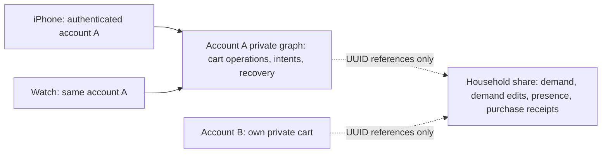

# ADR 0002: Personal carts and conditional checkout

- Date: 2026-09-24
- Issue: SHOPPING-118; implementation: SHOPPING-103; live gate: SHOPPING-30.
- Status: selected for implementation. The executable contract is local evidence, not deployed synchronization.
- Supersedes ADR 0001's global cart flag and its provisional scalar lifecycle conflict policy. Other household persistence decisions remain.

## Decision

A cart belongs to an authenticated iCloud shopper and follows that shopper's devices. Household demand is shared; optional Person assignment is unrelated to cart ownership. Use `NSPersistentCloudKitContainer` managed private/shared stores. Keep authoritative cart commands, checkout intents and recovery in an **unshared private graph**. Publish only advisory cart presence and purchase/restore receipts into the existing household share. Use scalar application UUID references between graphs, never Core Data relationships. No reciprocal presence shares, custom CloudKit record writer, or second sync engine.

A household writer can alter/delete shared projections and receipts at the CloudKit boundary. Read-only UI is not access control. Such changes can damage household information, including already shared demand, but **cannot mutate another account's private cart, quantity, command outcome or recovery**. Presence is never an input to a private command. Do not promise trustworthy absence, reservation, exclusivity, purchaser authentication, or real-time availability. Private receipts preserve the owner's audit/recovery even if household projections disappear. A missing shared projection must not be interpreted as an uncart command.

A separate owner-controlled read-only share would make presence harder for other writers to alter, but requires each shopper to create a share, invite every member, receive separate acceptance, manage membership changes/revocation, and handle partial acceptance on every device. Household membership does not confer that access. The accepted product contract does not require tamper-proof presence, so reject this complexity.

Apple's [Core Data sharing sample](https://developer.apple.com/documentation/coredata/sharing-core-data-objects-between-icloud-users) includes a watch target and separates private/shared database roles. Its [CKShare API](https://developer.apple.com/documentation/cloudkit/ckshare) defines share-level participant permissions. Neither promises atomic changes across our two graphs. The sample's availability label does not set Shopping's minimum OS; compile all production API use against iOS 17 and the selected Watch target minimum. Managed same-account Watch delivery remains a live gate.

## Identity and routing

Production `ShopperSession` is created only by the account service after available account status plus `CKContainer.userRecordID()` returns an actual record ID. Derive an opaque SHA-256 binding from a versioned canonical encoding of container, environment and authenticated account record name; derive the shopper UUID deterministically from that digest. The same account on two devices therefore has one shopper identity without a random-UUID provisioning race or alias merge. Persist the resulting binding and shopper UUID in the account's private graph and cache the verified session locally for provisioned offline use. The digest supplies identity, not authorization: the provider's verified account provenance and the private store boundary authorize commands. A caller-supplied matching digest or UUID does not authenticate a caller. Do not expose the record name in household presence; publish only the scoped shopper UUID and optional display-name snapshot. No authority derives from display names, Person IDs, device IDs, managed object IDs, or `CKCurrentUserDefaultName`.

Cache provisioning separately per container, environment and authenticated account. A provisioned offline session may use its already bound store. An unprovisioned offline install cannot claim legacy carts or create an attributed cart: show setup required and keep legacy review data. On an account-change notification, suspend commands immediately, close/detach the old account stores and invalidate checkout captures. Reauthentication selects a different store directory; never relabel, wipe, or export the previous account's queued operations. A temporary account lookup failure is not permission to silently switch owners. Household revocation disables household mutations/publication (including shared fulfillment and restore publication), retains private snapshots and recovery, and makes checkout report publication pending/unavailable rather than fabricate household success. Own private uncart/quantity cleanup and history remain available; restore can record a private recovery decision but must explicitly report its shared retraction pending. Never gate private cleanup on household write permission.

On Watch, provision identity directly against the same entitled CloudKit container and environment, then load that account's managed private store plus its participant shared store. Discover the household from imported shared graph membership (or the owner's shared household graph in their private database), not a phone-transmitted owner ID. Wait for complete household/list/store/catalog snapshots before shopping; do not create a substitute household when import is incomplete. An already provisioned Watch keeps its account-bound local snapshots and outbox through offline relaunch, and replays directly when its own network returns. WatchConnectivity may accelerate delivery or setup affordances later but is neither the authority nor a foreground-phone prerequisite. First-time share invitation acceptance may use the phone's system invitation flow for the same account; after acceptance, watch bootstrap must demonstrate account-level share availability through managed mirroring. If that propagation is unavailable on the supported watchOS version, SHOPPING-121 must expose a setup-required state and the live release gate fails; do not claim independent shopping based on a phone-only replica.

Add a private-graph classification that is excluded explicitly from `ShareAssociationScope.household(for:)`, its pending journal, and traversal into shared objects. `.private` database scope alone is insufficient: the household owner's share also lives in that database. Private cart objects have **no** relationship to Household, Need, Person, ClearOperation, or any shared graph object. Resolve household/list/occurrence UUIDs on the correct selected store when reading snapshots. Verify with `fetchShares(matching:)` that personal graph objects are unassociated in SHOPPING-30.

## Schema V7 contract

Retain V1–V6 models. V7 is additive; no uniqueness constraints, required CloudKit relationships, or hard deletes. Use optional attributes/defaults as required by managed CloudKit. Validate complete records before reduction; an incomplete import is loading/unavailable, never an empty cart. The table names logical entities; each immutable payload includes `schemaVersion = 1` and canonical sorted UUID arrays.

| Entity | Placement and key | Retained data / responsibility |
| --- | --- | --- |
| `ShopperAccount` | Unshared private; account binding + shopper UUID | Provisioning binding, canonical aliases. Not household Person. |
| `PersonalCartOperation` | Unshared private; operation UUID | Owner binding, household/list/occurrence UUIDs, membership generation UUID, action add/remove/setQuantity, complete observed ancestor operation IDs, optional quantity, retained title/category/notes snapshot. Immutable. |
| `PersonalCheckoutOperation` | Unshared private; operation UUID | Canonical command payload; captured scope; per-entry membership generation, cart evidence, demand evidence, display/quantity snapshots; per-entry accepted/skipped reason; intent/outbox state. Immutable intent; resumable local progress is a cache. |
| `PersonalCheckoutRestore` | Unshared private; restore operation UUID | Original checkout and per-entry receipt IDs, owner binding, restoration evidence and outcomes. Immutable tombstone of that purchase, not a blanket restore command. |
| `DemandMutation` | Household graph; operation UUID | Occurrence UUID, lifecycle generation UUID, action create/edit/remove, full causal ancestry and snapshot of changed demand fields. Retained safety evidence; no cart fields. |
| `HouseholdPurchaseReceipt` | Household graph; checkout UUID + occurrence UUID | Owner public UUID, optional name snapshot, exact occurrence/generation and demand evidence, quantity snapshot, purchase intent UUID, buy-anyway decision. Immutable semantic payload; advisory at trust boundary. |
| `HouseholdPurchaseRestore` | Household graph; original receipt key + restore UUID | Retraction of that receipt only. Private source of truth stays with its owner. Shared retractions never restore private membership; reduce cart restoration from authorized private restore records only. |
| `HouseholdCartPresence` | Household graph; owner/household/list/occurrence | Advisory generation, carted flag, optional quantity/name snapshot and private source digest. Never authoritative. |
| `LegacyCartReview` | Local durable migration quarantine; source store UUID + occurrence UUID + V6 marker | Unknown owner, old cart fields and quantity, original recovery payload, claim/keep/discard decision, target account binding if claimed. Never automatically published. |

The active cart is a projection keyed by owner/household/list/occurrence, not one mutable mirrored row. Local projection caches may accelerate rendering but are rebuildable. Concurrent physical duplicate records with the same logical operation ID and identical payload collapse. Different payloads with the same ID are quarantined as corruption, not resolved with a last-writer policy. Keep all winning and losing operations; do not prune until a separately designed cross-device acknowledgement/retention contract exists. This is a narrow retained log for cart membership/quantity and demand lifecycle, not a general application event engine.

Shared requested optional quantity is independent of cart optional quantity (nil or 1–99). Add copies the requested quantity once. Set-own-quantity changes only private cart operations. No subtraction, partial fulfillment, summing, reservation, or catalog mutation. Retained snapshots let owners inspect/remove purchased entries even after demand disappears or share access is revoked.

## Causality and membership

A local serialized command observes all known operations for its entry and stores their transitive ancestor IDs. Imported operations are a set union. Missing ancestors postpone reduction. For each occurrence, retain maximal operations (not ancestors of another operation). Causal successors win regardless of UUID or wall clock. Among truly concurrent maximal operations, explicit remove wins over add/quantity; otherwise lexical largest operation UUID wins the scalar quantity and its associated membership generation. Losing values remain inspectable in recovery/conflict detail. Ordinary add of an already active entry focuses it rather than emitting a new generation. Remove then add emits a fresh membership generation and observes the remove. Concurrent independent adds yield one projected entry and preserve the losing generation's snapshot.

Demand mutations use the same causal evidence scheme, partitioned by household/list/occurrence and lifecycle generation. Re-add of a fulfilled remembered item creates a fresh occurrence UUID and retains a `replacesOccurrenceID` lineage edge in its DemandMutation. A superseded original cannot become outstanding again through receipt retraction, even if replacement arrives after restore. This is a scalar UUID reference, not a cross-store relationship. Concurrent remembered replacements use the existing household/list/catalog canonical-occurrence rule and retain losing snapshots. Explicit renewal of an active occurrence emits a lifecycle mutation. Demand field edits produce a new evidence ID even if the assigned value is identical. Imported scalar caches must never overwrite this evidence. A receipt fulfills exactly its captured occurrence/generation **only while the complete current demand evidence equals its capture**. Any unseen edit arriving later makes that conditional fulfillment inapplicable and the changed demand outstanding again. The receipt remains purchase history. This conservative behavior can show an item again after a delayed benign edit; that is preferable to losing a request. UI detail explains that the request changed after checkout. It cannot promise instantaneous protection before an offline edit arrives.

A completed checkout suppresses an owner's cart membership only while the full current cart evidence equals the captured evidence and membership generation matches. If an unseen quantity/add edit arrives later, the private cart projection reappears with that surviving value and a purchase notice. A concurrent uncart keeps it removed. No broad query reruns at checkout or recovery. This is why ordinary local `Int64` revisions and a mutable global `carted` flag cannot satisfy the requirement: a checkout can pass its revision guard before the watch's offline edit arrives. The fixture reproduces this ordering and tests both deliveries.

| Conflict | Result after all relevant operations arrive |
| --- | --- |
| Same-owner causal quantity/edit | Causal successor wins, even lower UUID or clock. |
| Concurrent same-field quantities | Largest operation UUID wins; retain both values. |
| Concurrent add/quantity versus remove | Remove wins. A later observed re-add wins with fresh generation. |
| Different entries or owners | Independent; never import another owner's private operations. |
| Remove/re-add versus captured checkout | New generation/evidence survives; purchase receipt remains for old capture. |
| Unseen own quantity versus checkout | Quantity survives in cart with purchase notice; no shared quantity rewrite. |
| Demand edit versus fulfillment | Changed evidence remains outstanding in either delivery order. |
| New remembered occurrence versus old receipt | New occurrence remains outstanding; never target by catalog ID alone. |
| Two shoppers purchase the same occurrence | Both receipts retained; each owner's checkout affects only own captured membership. |
| Restore one of multiple purchases | Retract only that receipt; other applicable receipts keep demand fulfilled. |

## Commands and tokens

All commands enter a serialized account-bound service. UI supplies IDs/intent, never an authoritative owner. Resolve session and scope afresh; validate share permission only for shared writes. Canonical payload comparison is structural with sorted set encodings, not raw arbitrary JSON key order.

- `cartV1(operationID, householdID, listID, occurrenceID)`: validate known eligible demand and account. Return existing active entry when present. Otherwise append fresh membership generation with copied optional requested quantity and current evidence. Persist accepted result in the same private transaction.
- `uncartV1(operationID, entryKey, generation, expectedEvidence)` and `setCartQuantityV1(..., quantity?)`: require own account, complete current generation/evidence, and valid quantity. Append remove or quantity mutation. Stale tokens return durable skipped/changed outcome, not overwrite.
- `prepareCheckoutV1(scope)`: capture **own** visible eligible entries, exact UUIDs/generations, cart/demand evidence, local revisions for immediate guards, quantity/name snapshots, and current receipt-notice evidence. Return immutable token with token UUID/version/account binding/scope/captured entries. Preparation has no purchase side effect.
- `confirmCheckoutV1(operationID, token, explicitlyBuyAnywayReceiptIDs)`: compare token account and scope, refetch only captured entries, record accepted/skipped per-entry outcomes. A changed cart/demand capture is skipped. A newly arrived purchase notice requires a new explicit buy-anyway confirmation; never infer agreement. Empty valid set produces a persisted no-op result. Save accepted intent before publishing anything.
- `restoreCheckoutV1(operationID, originalCheckoutID, capturedReceiptIDs)`: operate on own private receipt/outcome only. Persist restore tombstones; reject cross-owner IDs. Restore cart only if its cart evidence/generation and captured demand evidence still match the checkout, and no replacement occurrence supersedes it; otherwise preserve later edits and report skipped. Recompute this condition on late replacement imports too: never resurrect a stale recovered original beside a newer request. The private historical receipt can be retracted without reviving a superseded occurrence. Retract only captured receipts. Never create a replacement need/catalog item or revive another generation. If another receipt still applies, leave fulfilled and show notice on the restored own entry.

Operation UUID identifies a logical action. Same ID and identical canonical payload replays its persisted outcome; different payload is rejected. Include rejected/skipped decisions in private command outcome records so a retry cannot later mutate a newly valid entry. Do not use actor/device UUID ordering or revision counters as a distributed timestamp. A device UUID may label diagnostics only.

"Already purchased by …" derives from a retained applicable purchase notice plus optional name snapshot. If name is unavailable, use "Already purchased". It does not remove another shopper's entry. Their own actions are Remove and Buy anyway in item detail. Buy anyway writes another purchase receipt for the **original** occurrence; it never revives or fulfills a replacement. Multiple receipts, including buy-anyway receipts, keep the original fulfilled until all applicable receipts are retracted. A notice can remain for an edited original whose changed demand is outstanding; details explain the difference. Dense rows need no redundant metadata.

## Durable checkout and repair

There is no atomic cross-store/cloud save. Treat local private and household saves as independent durable steps, and remote delivery as independently ordered:

1. **Private save A:** persist immutable intent, per-entry accepted/skipped outcomes and private purchase receipt snapshot. Mark accepted membership provisionally checked out in the local projection; display local success with sync pending. Preserve exact captured values for recovery.
2. **Household save B:** upsert each logical receipt using checkout UUID + occurrence UUID. This produces conditional fulfillment; do not destructively archive Need based solely on its current scalar revision. If the share is unwritable, leave an explicit pending outbox, retain private recovery and retry after permission/account validation.
3. **Private save C:** record local publication outcome and completed projection. Publication success means saved locally, not CloudKit acknowledgement or another device delivery. Presence publication is independent and advisory.
4. **Relaunch/foreground/import:** replay pending A intents into B by logical key, then C. Re-reducing after every import may re-expose changed demand/cart even after C. Recovery remains available before or after B. Restore before B still publishes a matching receipt+retraction or suppresses both only when neither has ever been exported; prefer publishing both to avoid unknown export status. Never discard an intent simply because it was restored.

The fixture leaves the cart visible between A and C so the cross-store boundaries are explicit; production may project A as provisionally hidden only with its pending outcome visible and immediately recoverable. This UI optimization must not change replay or evidence rules.

Crash before A has no side effect. Crash after A/before B replays the captured intent. Crash after B/before C finds the same receipt key and finishes without a second purchase. Crash after C/before UI acknowledgement reopens the durable result/recovery. Cloud receipt arriving before demand ancestors or cart evidence is incomplete: retain it and wait; never treat missing data as eligible deletion. Per-entry failures must not expand scope or erase successful peers. Failing private save A means no household write.

Projection repair runs at most once per owner foreground pass, actual private mutation, or explicit refresh. Compare canonical source digest; publish changed/missing presence once, no-op at the fixed point. Do not launch another repair merely because the repair itself caused a notification. Back off permission/network failures; do not battle a hostile household writer in an endless republish loop. Deletion of presence cannot trigger owner uncart. Receipt repair likewise starts only from the owner's durable intent, never reconstructs authority from the household projection.

## Migration and rollout

First inspect released signing entitlements and whether any legacy managed household graph actually exists. The current app bootstrap is local; no existing production CloudKit household is established by this ADR. If there are no legacy entitled shared writers/graphs, initialize V7 normally in the chosen configured container and apply the local migration below; no export/import or reinvitation ceremony is required. Record that evidence in SHOPPING-30.

If a live legacy graph is confirmed, mixed V6 and V7 writers on the same household graph are unsupported: old binaries can still write `Need.carted`, archive with old ClearOperation rules and cannot preserve causal evidence. A V7 feature flag or shared minimum-version field cannot prevent that. For that confirmed mixed-writer case, before enabling live personal carts use a **new CloudKit container identifier and fresh household share graph** available only in newly signed V7-capable binaries. Existing shipping binaries lack that container entitlement. Migrate via explicit user-approved export/import with a durable source-to-target UUID mapping, then invite members to the new share. Keep the old graph intact/read-only in the new app for migration review; do not falsely claim to freeze writes made by old apps in the old container. New and old households do not synchronize. This conditional operational boundary is a release prerequisite only when legacy managed writers exist, not something SHOPPING-103 silently performs. No production schema reset is allowed.

For the current local/pre-release installation, run V6→V7 lightweight additive migration, then idempotent application migration under a durable ledger:

1. Snapshot each legacy `Need.carted/cartedAt`, optional quantity, occurrence/list/household IDs and relevant `ClearOperation` payload into `LegacyCartReview`. Stable migration key is source-store UUID + occurrence UUID + fixed migration version `personal-cart-v1`; never derive from current date or a new random UUID on each launch. Persist ledger and snapshot in one local save before clearing any legacy presentation flag.
2. Unknown owner stays in review. **Keep for review** retains it without attribution; **Claim as mine** requires authenticated session plus explicit selection, creates a deterministic claim operation referencing the review key and copies optional quantity into that owner's private cart; **Discard legacy cart status** records a durable decision and leaves shared demand/catalog untouched. Repeated claim on relaunch replays the same command ID; changed target account is rejected. Other accounts do not automatically receive the claim.
3. Preserve old clear history and encoded tokens as legacy recovery, explicitly unattributed. Do not manufacture private ownership or silently replay old household restore tokens. Offer inspection and explicit creation of a new need when appropriate; require duplicate/current-occurrence checks and show that it is a new request. Old clear records remain audit data and never enter the new automatic checkout replay.
4. No migration infers an owner from household creator, assigned Person, `cartedAt`, or first launched device. Nil quantity stays nil. Never overwrite shared requested quantity from a claim. Preserve one-time identity and snapshots without generating catalog suggestions.
5. Migration crash tests in 103 cover before snapshot commit, after snapshot/before claim, after private claim/before ledger acknowledgement, and after restart with another account. Each must yield one review record and at most one claimed entry. A failed model load preserves the source store and presents recovery rather than recreating it.

## Bounded patch plan for SHOPPING-103

1. Add V7 model and managed types in new files beside `PersistenceModels.swift`; keep V6 fixture. Add private entities and explicit routing/classification exclusions in `PersistenceConfiguration`, `PersistenceController`, `ManagedShareAssociation` and permissions. Do not place new commands inside the already large `NeedService.swift`: use `PersonalCartService`, `ShopperSession`, `CheckoutOutbox` and a small reducer with value tokens.
2. Add immutable operation insertion and imported duplicate/conflict handling. Persistent history triggers projection rebuilding for affected UUID keys, including demand lifecycle mutation evidence. `NeedService` writes demand mutations in the same store transaction as requested quantity/edit/re-add; local scalar revisions remain immediate guards only. Remove `Need.carted` as input from all production list/cart/checkout queries once migration is selected.
3. Replace `CartedNeedOrdering`, `CheckoutDraft`, checkout preview/result and `RecentlyClearedView` inputs with owner-scoped snapshots/outcomes. Keep category ordering and existing store eligibility predicates. UI can inspect another shopper's advisory presence but receives no mutation token for that entry. Shared filters never broaden eligibility for urgency.
4. Implement durable per-entry checkout/restore commands and replay, permission loss/account switching, notice + Remove/Buy anyway, and migration review. Reuse the existing writer serialization/rollback and persistent-history mechanisms; do not mutate mirrored CKRecords directly.
5. Port fixture cases into Fast tests using unique SQLite stores, true close/reopen and injected saves. Add account/share exclusion, stale token/idempotency, incomplete import, duplicate ID payload quarantine, migration crash, and production API ownership tests. Keep existing clear/one-time/catalog safety proofs adapted to the new semantics. Add representative own-cart and other-shopper-notice UI workflows; no simulator-only product branch.

## Executable evidence and remaining gates

Run `swift test --package-path Prototypes/PersonalCartContract`. The package is an isolated executable specification using native Swift value types and atomic JSON checkpoints. It is not linked into the app and does not claim Core Data migration/transactions, OS process-kill durability, authenticated account lookup or CloudKit permissions. String labels stand in for UUIDs; `authenticatedOwner` is a test session, not a production authentication implementation. Tests own simulated private/shared operation delivery, causal reduction, every A/B/C restart checkpoint, durable replay, competing purchases/restore, payload reuse/permission rejection, and bounded presence repair. Fixture merge represents trusted transport delivery; it is not a hostile CloudKit payload validator. Production must reject malformed/foreign private payloads and isolate account files before invoking the reducer.

SHOPPING-103 must implement and test those production boundaries. SHOPPING-30 must record: two real iCloud accounts; private graph absent from the household share; household writer cannot reach owner private records; visible presence remains advisory; private phone/Watch records converge with phone left home; account switch/revocation does not leak queues; concurrent offline quantity/remove/re-add versus checkout in both reconnection orders; receipt-before-ancestor imports; export interruption/relaunch and restore across devices; shared participation creation and permissions; legacy-entitlement audit and, only when required, fresh-container rollout/re-invitation. Enrollment remains a live gate, not a reason to skip local architecture. Neither this ADR nor the fixture proves the watch can receive all needed household data while the phone is absent.

Local validation on 2026-09-24: Apple Swift 6.4 (`swiftlang-6.4.0.34.1`),
arm64 macOS host, all 10 XCTest cases passed with zero failures (0.010 seconds test
execution; 1.65 seconds incremental build). `git diff --check` passed. Independent
architecture review identified and resolved two safety gaps before integration:
replacement lineage now prevents stale undo reviving the old occurrence, and household
receipt retractions are isolated from authoritative private restore intents. No iOS or
Watch simulator was used for this isolated contract fixture.
